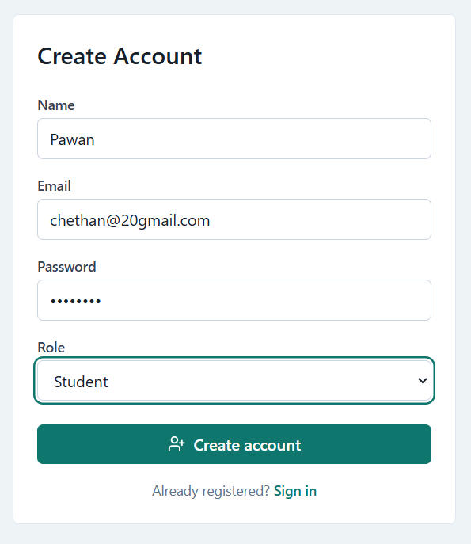
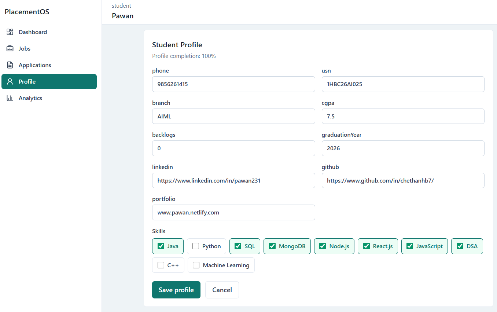
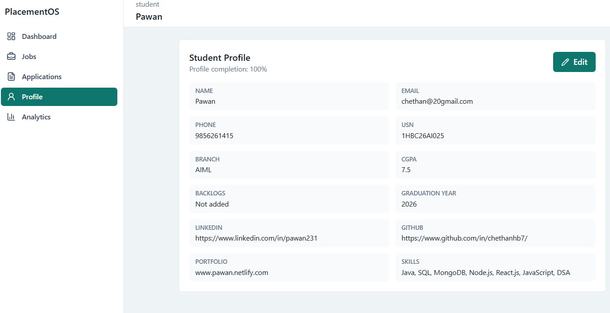
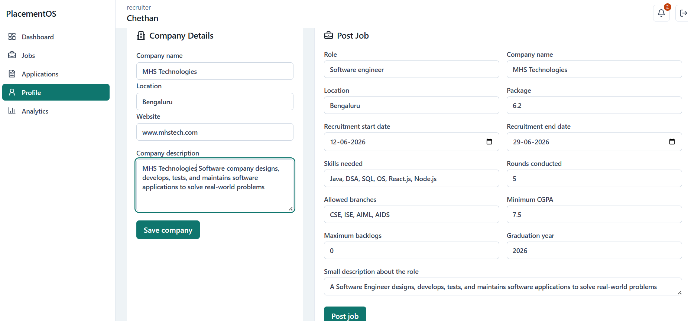
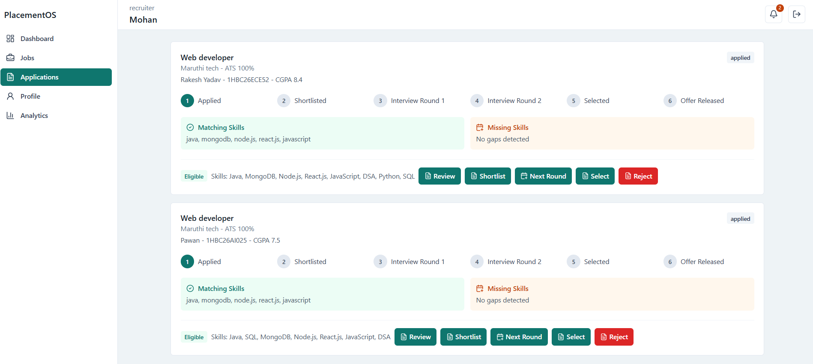
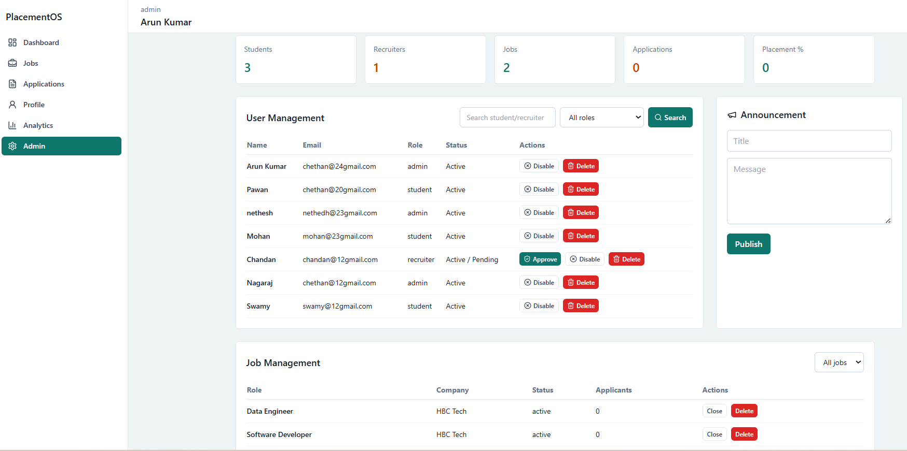

<div align="center">

# 🎓 Smart College Placement Management System

### A full-stack campus recruitment platform connecting Students, Recruiters & Placement Administrators

[](https://smart-placement-mgmt-system.netlify.app/login)
[](https://smart-placement-api-ez7x.onrender.com/)
[](https://smart-placement-api-ez7x.onrender.com/api/health)


</div>

---

## 📌 About the Project

The **Smart College Placement Management System** automates and streamlines the end-to-end campus recruitment process. It provides role-specific portals for **Students**, **Recruiters**, and **Placement Admins** — handling everything from job postings and eligibility checks to application tracking and placement analytics — all in one centralized platform.

---

## 🔗 Live Links

| Service        | URL                                                                                              |
| -------------- | ------------------------------------------------------------------------------------------------ |
| 🌐 Frontend    | [smart-placement-mgmt-system.netlify.app](https://smart-placement-mgmt-system.netlify.app/login) |
| ⚙️ Backend API | [smart-placement-api-ez7x.onrender.com](https://smart-placement-api-ez7x.onrender.com/)          |
| ✅ API Health  | [/api/health](https://smart-placement-api-ez7x.onrender.com/api/health)                          |

> ⚠️ Backend hosted on Render free tier — may take ~30 seconds to wake up on first request.

---

## ✨ Features Overview

<details>
<summary><b>🔐 User Registration & Authentication</b></summary>

<br>

- Secure sign-up and login with **JWT-based authorization**
- **Role-based access control** — Student, Recruiter, Admin
- Protected routes and persistent session management

</details>

<details>
<summary><b>🎓 Student Portal</b></summary>

<br>

**Dashboard**

- View active hiring opportunities
- Track placement probability and analytics
- Receive real-time placement notifications

**Profile Management** — Students can save:

- Personal details (Name, USN, Phone, Branch, CGPA, Graduation Year)
- Academic info (Backlogs, Graduation Year)
- Links (LinkedIn, GitHub, Portfolio)
- Technical skills (Java, Python, React.js, Node.js, SQL, ML, DSA, and more)

**Application Tracking** — Live status updates across stages:
`Applied → Shortlisted → Interview Round 1 → Interview Round 2 → Selected → Offer Released`



</details>

<details>
<summary><b>🏢 Recruiter Portal</b></summary>

<br>

**Job Posting** — Create listings with:

- Role, Company, Salary Package
- Min CGPA, Max Backlogs, Required Skills
- Hiring Rounds, Application Start/End Dates

**Candidate Management**

- View and review applicant profiles
- Eligibility validation and skill-gap analysis
- Shortlist, advance rounds, select, or reject candidates
  



</details>

<details>
<summary><b>🛡️ Admin Portal</b></summary>

<br>

- **User Management** — Manage students, recruiters, and admins
- **Recruiter Approval** — Approve, disable, or delete recruiter accounts
- **Job Management** — View, close, or remove job postings
- **Announcements** — Broadcast placement updates and notices to all users
- **Analytics** — Track students, recruiters, jobs posted, applications, and placement percentage
  

</details>

---

## 🛠️ Tech Stack

| Layer          | Technology                                                                   |
| -------------- | ---------------------------------------------------------------------------- |
| **Frontend**   | React.js, JavaScript (ES6+), React Router DOM, Axios, Socket.IO Client, CSS3 |
| **Backend**    | Node.js, Express.js, JWT Authentication, Socket.IO, REST APIs                |
| **Database**   | MongoDB Atlas, Mongoose ODM                                                  |
| **Deployment** | Netlify (Frontend), Render (Backend), MongoDB Atlas (Database)               |

---

## ⚙️ Key Technical Highlights

- **JWT Authentication** with protected routes and role-based access control
- **Real-time notifications** via Socket.IO for live application status updates
- **Automated eligibility validation** — checks CGPA, backlogs, skills, and graduation year before allowing a student to apply
- **Skill-gap analysis** — identifies missing skills between a student's profile and job requirements
- **Full recruitment lifecycle** — from job creation to offer release, managed in one workflow

---

## 📁 Project Structure

```
Smart-College-Placement-Management-System/
│
├── frontend/
│   └── src/
│       ├── components/
│       ├── pages/
│       ├── hooks/
│       ├── services/
│       ├── layouts/
│       ├── context/
│       └── utils/
│
├── backend/
│   └── src/
│       ├── config/
│       ├── controllers/
│       ├── middlewares/
│       ├── models/
│       ├── repositories/
│       ├── routes/
│       ├── services/
│       └── utils/
│
├── .github/
├── README.md
└── package.json
```

---

## 🚀 Getting Started

### Prerequisites

- Node.js v18+
- MongoDB Atlas account
- npm or yarn

### Installation

```bash
# Clone the repository
git clone https://github.com/H-B-Chethan/Smart-College-Placement-Management-System.git
cd Smart-College-Placement-Management-System

# Install backend dependencies
cd backend
npm install

# Install frontend dependencies
cd ../frontend
npm install
```

### Environment Variables

Create a `.env` file in the `backend/` directory:

```env
PORT=5000
MONGO_URI=your_mongodb_atlas_connection_string
JWT_SECRET=your_jwt_secret_key
```

### Run Locally

```bash
# Start backend (from /backend)
npm run dev

# Start frontend (from /frontend)
npm start
```

---

## 🔮 Future Enhancements

- [ ] Resume upload and parsing
- [ ] Email notifications for application updates
- [ ] Interview scheduling system
- [ ] AI-based candidate–job matching
- [ ] Placement prediction analytics
- [ ] Company assessment portal
- [ ] Multi-college support
- [ ] Advanced reporting dashboard

---

## 👨‍💻 Developed By

<div align="center">

### Chethan H B

**Computer Science & Engineering**  
Global Academy of Technology

[](https://github.com/H-B-Chethan)

</div>

---

<div align="center">

⭐ If you found this project helpful, please consider giving it a star!

</div>
